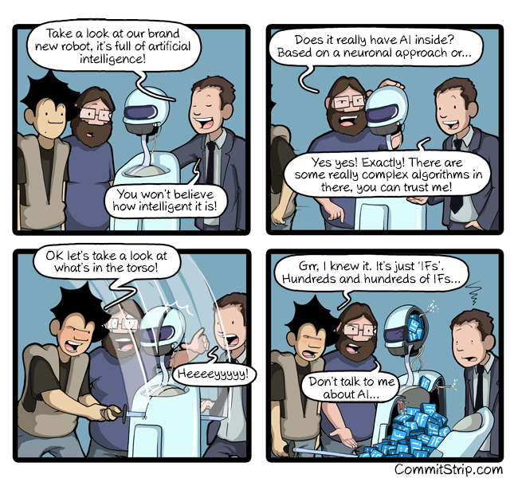
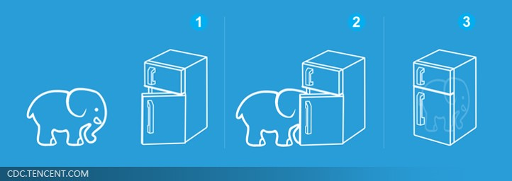
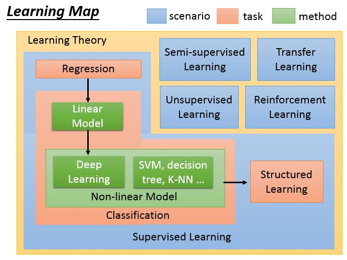
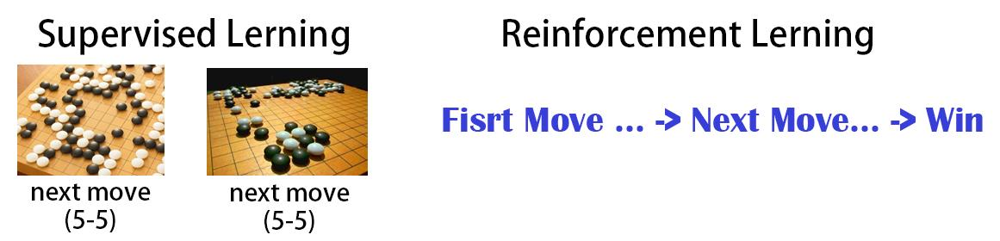

# Introduction to machine learning

\[[lecture](../lectures/introduction.pdf)\]
\[[video1](https://youtu.be/CXgbekl66jc)\]
\[[video2](https://www.youtube.com/watch?v=On1N8u1z2Ng)\]

<!-- TOC -->

- [Introduction to machine learning](#introduction-to-machine-learning)
    - [AI VS. Machine Learning VS. Deep Learning](#ai-vs-machine-learning-vs-deep-learning)
    - [What is Machine Learning?](#what-is-machine-learning)
    - [Machine Learning Framework](#machine-learning-framework)
        - [Define a set of funciton](#define-a-set-of-funciton)
        - [Goodness of function](#goodness-of-function)
        - [Pick the best function](#pick-the-best-function)
    - [Learning Map](#learning-map)
        - [Regession](#regession)
        - [Classification](#classification)
        - [Semi-supervised Learning](#semi-supervised-learning)
        - [Unsupervised Learning](#unsupervised-learning)
        - [Structured Learning](#structured-learning)
        - [Reinforcement Learning](#reinforcement-learning)

<!-- /TOC -->

## AI VS. Machine Learning VS. Deep Learning

AI实际是一个很早就提出来的概念，早在1950年左右，AI概念就已经在全世界流利，虽然那时候计算机也才刚刚问题世。但那个时候的一些AI系统大多都是基于规则的，系统里的逻辑都是人工设定好的逻辑（rule based），而且逻辑都比较简单,这种通过人工手动设计规则的智能是一种伪智能，它永远不可能超过人类，它本身没有任何的free style, 这个时代实际上是人们提出了一种人工智能的愿景，但是没有找到很好的实现AI的方法。

1980年左右开始出来了一批以概率统计为基石的机器学习的方法，比如MLP、SVM、Desion Tree等，这些方法使得早期的一些AI概念得到一定的实现。

到了2010年前后，随着互联网的普及，大量数据产生了，同时计算机的计算能力随着GPU在通用计算上的应用得到大幅度的提升。Deep Learning这个新词汇出现在人们的视野当中，并以星火燎原之势火遍了全球。它实际是算是机器学习中的一种方法，只是因为比较有效，所以流行起来。

总体来说，50年代的AI实际是一种概念的提出与人们美好的愿景，80年代开始人们找到了机器学习这个手段来实现当初的人工智能的梦想，但受限于方法与计算能力，那个阶段的机器学习方法只在很小的一领域得到了应用。到了21世纪，随着深度学习的野蛮生长，机器学习的方法已经在向各个行业渗透，而且在很多领域取得了比人类更高的准确率，AI开始真正的走向了人类的生活并参与到人类的行业生产中。

## What is Machine Learning?

从字面上来理解，Machine Learning一拆为二，Machine指明了主体是一个Machine，我们可以理解为一个Computer或者是一个程序，Learning说明了这个程序具有学习的功能，能够通过大量数据的输入来自动的学习到这些数据的一些潜在规律或形式，在下次再看到一些新的数据时，可以分辨或认出。

常见的学习任务比如：
- 语音识别：通过大量语音与对应语言词汇（句子）的学习，机器可以把新输出的语音转换为对应的文本。
- 图像识别：机器学习学习大量猫或狗的照片，可以对新的猫或狗的照片进行辨识。

所以从任务上来看，机器学习就是在找一个Function,这个Function可以根据输出得到一个想要的输出，比如：

- Speech Recognition: f(一段语音信号) = “How are You”
- Image Recognition: f(一张猫的图片) = “Cat”
- Playing Go: f(当前的棋局) = “5-5”（next move）
- Dialogue System: f("Hi") = "Hello"

## Machine Learning Framework

- Step1: Define a set of funciton
- Step2: Goodness of function
- Step3: Pick the best function

### Define a set of funciton

当我们在根据一个特定的问题设计机器学习算法时，首先第一步就是要想好我们的Function Set，我们需要从function set中挑选适合问题的function。那实际上如何来定义这样的Function Set呢，一般需要一些Domain Knowledge，而且一些概念统计的方法也为我们选择function set提供了指导。

比如对于房屋价格的预测问题，我们就可以挑选线性函数（$\sum_i x_iw_i$）作为我们的Function set，具体挑选哪一个线性函数呢，那将由第二步和第三步来完成。

### Goodness of function

有了一个Function Set后，我们需要定义一个评价函数，用来说明我们从Function set中选择的function的好坏。那么这个评价函数就是关于我们挑选的模型（function）的函数，到后面就知道了，也就是经过常到的**损失函数**。

### Pick the best function

当我们有一个function set并且有了关于function的评价函数后，我们就可以挑选出最好的一个function来作为我们要解决的问题的模型函数了。这里往往是一个最优化的问题。

## Learning Map

### Regession

回归模型有一个很明显的特点是：它的输出是一个`Scalar`，比如预测明天的PM2.5。

### Classification

分类问题可以分为二分类或多分类问题。

对于二分类问题，它的输出一般是“是”或“否”，在数学上我们可以用0或1来表示，也可以用-1与+1来表示，到底用什么来表示，其际上对于问题本身是无所谓的，那在实际的机器学习方法中，我们会根据方法的数学表达的方便来选择合适的值。常见的二分类问题比如垃圾邮件的分类、疾病的诊断等。

对于多分类问题它的输出是一个类别的标签，在数学表达上我们常用的方法是把输出表示为一个长度等于类别数的一个向量$y = [y_1,y_2,\cdots,y_k]$，其中$k$为类别数。对于输出$y$，哪一个分量最大，则代表输入属于哪一类。常见的多分类问题有：图片的分类、新闻的主题归类等。

### Semi-supervised Learning

上面说的回归与分类问题都是属于有监督的学习问题，它的特点是训练数据都是带有标签的。而实际上搜集大量带标签的数据是一件很难的事情。那针对于现实中大量无标准的数据，我们可以采用半监督的学习方法以及无监督的学习方法。

这里需要区别的是半监督学习与迁移学习的不同。

半监督学习解决的问题中有标签的数据与无标签数据是有关系的，属性同一类型的问题，比如我们已经有一些猫和狗的带标签照片，如果把大量没带标签的猫和狗的照片用起来，这是半监督学习要考虑的事。而如果我们已经有很多带标签的猫和狗的照片，我们想训练一个模型来识别大像和老虎的图片，那么这就属于迁移学习的范畴了。

### Unsupervised Learning

无监督学习研究如何让机器通过大量没有label的数据，自动的学习到数据与数据之间的差异以及数据背后的一些潜在的结构或分布。比如通过学习大量图片后，机器能否根据一个code(编码后的数据)自动的生成一张逼近真实的照片

### Structured Learning

Structured learning是分类与回归问题之外的一种机器学习方法，它的学习目标不是输出一个`Scalar`或者一个类别标签。而是一个带有结构的数据。比如在语音识别中输出是一个句子，在目标检测中，输出的是目标的位置。

### Reinforcement Learning

强化学习有点像有监督的学习，但两者又有很大的不同。有监督的学习是learn from teacher，而强化学习是learn from critics。强化学习往往是针对一个多步骤的任务，每一步骤并不能得到实时的反馈，只能根据最终整个任务的完成情况或评价结果来得到反馈。

举例：AlpahGo中同时用到了有监督的学习与强化学习，在刚才始学习如何下棋时，用的是有监督的学习，根据一些棋谱学习每一步之后下一步应该怎么下。当机器具有基本的下棋能力后，再开始根据每一局对弈的结果进行强化学习，通过机器与机器的下棋来产生大量的棋局进行强化学习。

