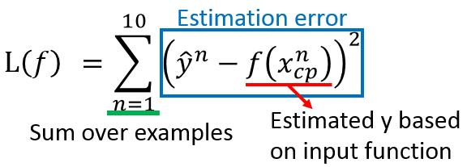
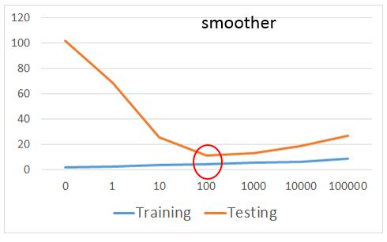

# Regression
\[[lecture](../lectures/regression.pdf)\]
\[[video](https://www.bilibili.com/video/av10590361/#page=2)\]

<!-- TOC -->

- [Regression](#regression)
    - [Estimating the CP of a pokemon afer evolution](#estimating-the-cp-of-a-pokemon-afer-evolution)
    - [Step1 Model](#step1-model)
    - [Step2 Goodness of Function](#step2-goodness-of-function)
    - [Step3 Best Function](#step3-best-function)
    - [Gradient Descent](#gradient-descent)
    - [How the result](#how-the-result)
    - [Hidden Factors](#hidden-factors)
    - [Regularization](#regularization)

<!-- /TOC -->

在上一篇的笔记里，我们已经总体上介绍了机器学习中常见的Scenario，以及每个Scenario中有哪些常见Task。今天要讲的Regression就是属于Supervised Learning这个Scenario下的task。

在Instroduction里提到了回归与分类最大的不同在于，回归的输出是一个`Scalar`，在现实生活中我们会预到很多问题的输出都是一个`Scalar`，比如股票未来走势的预测，自动驾驶决策中方向盘的角度，购物网站中推荐系统预测消费者A购买商品B的可能性等。

有些人可能会有疑问，在某些分类问题中，我们经常预测输入属于某一类别的概率，它的输出是一个概率值，也是一个`Scalar`,为什么不叫回归呢。注意，问题的本身的输出还是一个类别标签，而转化输出某一个类别的概率是一种数学求解思路。

## Estimating the CP of a pokemon afer evolution

这里我们通过一个例子来说明Regression是如何解决问题的。我们的例子是预测宝可梦进化后的CP（Combat Power）值。

对于这个示例，我们输入是一个宝可梦，输出是这个宝可梦进化后的CP值。

$$f(\text{Pokemon}) = \text{CP after evolution}$$

我们可以用一些属性的值，比如进化前的CP值，宝可梦的种类，生命值，重量，高度等来表示一个宝可梦

$$x = [x_{cp},x_s,x_{hp},x_w,x_h]$$

为了简化起见，我们先从最简单的情况开始，我们只用宝可梦进化前的CP($x_{cp})$来代表一只宝可梦，用$y$来表示宝可梦进化后的CP值。

## Step1 Model

之前我们介绍到了机器学习的第一步是定义一个Function Set，这里我们讲Regression，我们要为宝可梦CP值的预测选择一个Function Set，根据一些Domain知识，我们选择线性回归的模型来解决这个问题。

$$y = b + \sum w_ix_i$$

针对宝可梦的问题，我们的Function Set也就是一个一元线性回归的模型：$y = b + w \cdot x_{cp}$，这里我们$x$只选择了宝可梦进前化的CP值，所以维度为1,后面将其他属性都考虑上时的线程模型也是显而易见的。

## Step2 Goodness of Function

现在我们已经选择了一个Function Set: $y = b + w \cdot x_{cp}$，这里有两个未知的变量$w$和$b$，所有可能的$w$和$b$构成了整个Function Set，那我们如何选择合适的$w$和$b$呢，我们需要找到一个评价函数。

我们希望我们找到的模型可以很好的预测宝可梦进化后的CP值，那我们肯定要先有一些宝可梦和它们进度化的CP，有了这些数据，我们才能用这些数据评价我们的模型，这些数据为**训练数据**。它们的形式为$(x^1,\hat{y}^1),(x^2,\hat{y}^2),\cdots,(x^n,\hat{y}^n)$

我们为宝可梦的问题定义如下的评价函数（损失函数）

我们将选择的function代入到上面的公式中，就得到了：

$$L(w,b) = \sum_{n=1}^{10}(\hat{y}^n-(b+w\cdot x_{cp}^n))^2$$

## Step3 Best Function

现在我们问题只剩下最后一步了，在我们的Function Set中找到一个$f$，它是能让我们步骤2中定义的$L(f)$最小的那个。

$$f^* = arg\max_f L(f)$$

我们也可以把上面公式转化为关于$w$和$b$的问题。

$$w^*,b^* = arg\max_{w,b}L(w,b) = arg\max_{w,b}\sum^{10}_{n=1}(\hat{y}^n-(b+w\cdot x_{cp}^n))^2$$

那么我们如何来求解上面的公式呢？如果你比较熟悉线性代数，你已经发现上面的方程是有一个解析解的，我们通过简单的矩阵运算可以很轻松求出最好的$w$和$b$。

在这里我们将介绍一个机器学习中很流行，很强大的方法：Gradient Descent。

## Gradient Descent

我们这里先用Gradinet Descent来求解$w^* = arg\max_wL(w)$，梯度下降的步骤是：
1. 对$w$随机初始化为$w^0$
2. 计算$L(w)$在$w_0$处的导数$\frac{dL}{dw}|_{w=w^0}$
3. 更新$w: w_1 \gets w_0 - \eta\frac{dL}{dw}|_{w=w^0}$
4. 重复步骤2与步骤3很多次。

在上面的步骤中，我们通过计算$\frac{dL}{dw}|_{w=w^0}$指明了$L(w)$在点$w^0$处下降最快的反方向，同时用一个更新率$\eta$来控制每次更新的幅度。通过多次迭代，$L(w)$最终会越来越小，拼接近最小值。

上面我们讨论了只有一个变量时，如何求解$L(w)$的最小值，而宝可梦的问题的最优化任务是两个参数$w$和$b$，我们可以很容易把上面的梯度下降算法应用在$L(w,b)$上。

1. 对$w$和$b$进行随机初始化为$w^0$和$b^0$
2. 计算L关于$w$和$b$的偏导数$\frac{\partial L}{\partial w}|_{w=w^0,b=b^0},\frac{\partial L}{\partial b}|_{w=w^0,b=b^0}$
3. 更新$w$和$b$：$w_1 \gets w_0 - \eta\frac{\partial L}{\partial w}|_{w=w^0,b=b^0}, b_1 \gets b_0 - \eta\frac{\partial L}{\partial b}|_{w=w^0,b=b^0}$
4. 重复步骤2与步骤3很多次。

注：上面步骤中关于如何求解$L(w,b)$关于$w$与$b$的偏导数，是很基础的微积分的知识，这里就从略了。关于梯度下降的话题，我们将在后面的课程中更加细致全面的讲解。

## How the result

上面我们按照机器学习的三步的一个框架对我们的宝可梦问题进行了求解，通过步骤3,我们已经可以求出一个最佳的$w$和$b$，那么我们最终得到的线性回归模型$y = w\cdot x_{cp} + b$表现到底如何呢。

我们通过10只宝可梦的数据训练我们的模型，得到了$\frac{1}{10}\sum_{n=1}^{10}e^n=31.9$的训练误差。

我们又找到10只宝可梦作为测试数据集，进一步看我们的模型的表现，得到了35.0的平均测试误差。

现在我们回过头审视我们最开始的步骤：模型选择，为了简化，我们选择一个相当简单的模型一元线程模型，那么如果我们考虑更复杂的特征，用多元线程回归模型来作为我们Function Set效果会发生什么变化呢。

从上面其他模型选择测试中可以看出，一个更复的复杂的模型往往能在训练集上取得更小的误差，但是在测试集上表现确不尽然。这种现像称为**Overfitting**。

越复杂的model，则model参数可行域就越大，从而就更容易找到适合training data的参数。关于更加理论的解释，我们将会在下一节中重点介绍

## Hidden Factors

当我们搜集到更多的宝可梦的数据进行训练时，我们发现之前定义的模型无论如何都无法达到一个满意的效果，于是，我们对搜集的训练数据进行了可视化，如下：

通过更细致的分析数据，我们发现，数据呈现了多个线性模型的可能。回到我们的步骤1中，我们只选择了宝可梦进化前的cp值作为宝可梦的特征。这里我们容易想到，宝可梦的种类可能也是一个很重要的特征，在决定宝可梦进化后的CP值上起很关键的作用。

所以这时，我们考虑一个更复杂的模型，把宝可梦的种类也考虑到模型中。我们的模型变为：

用新定义的模型，我们重新进行训练，并最终计算误差：

既然宝可梦的种类有如此好的效果，我们就会想其他宝可梦的属性如何，我们设计一个模型把所有宝可梦的属性都考虑，并且把模型设计的复杂一些。

很显然，我们遇到了之前同样的问题：过拟合！！

## Regularization

既然，我们在模型选择很容易选择一个很复杂的模型，而遇到过拟合的问题，那么我们如何避免呢，我们回到第二步中，重新设计我们的评价函数，这次我们评价函数把模型的复杂度也考虑进去。

$$L = \sum_n\left(\hat{y}^n - (b+\sum w_ix_i)\right)^2+\lambda\sum(w_i)^2$$

在面等式与前面相比，我们在最后多加一项$\lambda\sum(w_i)^2$，加入后在我们最小化$L$时，我们会更倾向于选择$w_i$都很小的模型。更小的$w_i$就意味着整个模型会更加平滑，平滑的函数对噪声的容忍能力就会很强，不容易过拟合。

$$f(x+\Delta x) = b+\sum w_i(x_i + \Delta x_i)=y + \sum w_i\Delta x_i $$

虽然我们喜欢更平滑的函数，但是也不能一味的追求平滑，如果函数太平滑，对任何输入，输出基本就没有什么变化，模型就失去了预测能力。

思考： 这里最终我们通过正则化在测试集上达到了11.1的平均误差，那如何再有新的测试数据，正常来说我们的模型在这些新的数据上的平均误差是会高于11.1还是低于11.1还是基本一致呢？

