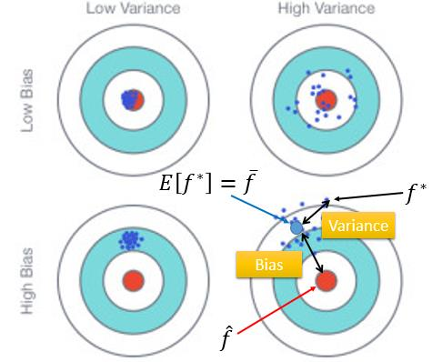

# Model Selection

\[[lecture](../lectures/bias_and_variance.pdf)\]
\[[video](https://www.bilibili.com/video/av10590361/#page=3)\]

<!-- TOC -->

- [Model Selection](#model-selection)
    - [Where does the error come from?](#where-does-the-error-come-from)
    - [Diagnose our model](#diagnose-our-model)
    - [Model Selection](#model-selection-1)

<!-- /TOC -->

在上一节Regression中，我们通过宝可梦进化后CP值的回归问题把解决机器学习的三个步骤进行了串讲，回顾一下这三个步骤：
1. Define a set of funciton
2. Goodness of function
3. Pick the best function

这一节我们将回到步骤一上来，介绍我们如何更好的选择一个function set。

## Where does the error come from?

在上一节的最后我们讲到了模型复杂度与过拟合问题，我们发现复杂的模型在traning data上往往有较好的准确度，但是在testing data上表现却不好。让我们更深入的分析一下，当我们选择了一个模型时，无论是在training data上还是testing data上，我们的误差是由什么产生的呢？

误差来源于`Biase`和`Variance`，我们先不解释为什么，先看一下`Bias`和`Variance`是什么？

在统计学中，假设我们研究随机变量$X$，它实际上是服从一个均值为$\mu$，方差为$\sigma$的分布（具体是什么分布，这里不关心），但是具体的$\mu, \sigma$我们是不知道的，我们通过大量的观测得到了一系列$X$的观测值${x^1,x^2,\cdots,x^N}$来对$\mu$和$\sigma$进行估计。根据统计的知识我们可以得到下面的估计：

$$m = \frac{1}{N}\sum_nx^n$$
$$s = \frac{1}{N}\sum_n(x^n-m)^2$$

但是我们根据观测数据估计出来的这两个量$m$和$s$与实际的$\mu$和$\sigma$还有差距，那到底差多少呢？有多大的浮动呢？我们先重点关注$m$，计算$m$的均值和方差。

$$E[m] = \mu$$
$$Var[m] = \frac{\sigma^2}{N}$$

从上面的式中有可能看到，虽然我们的估计的均值$m$与$\mu$一般来说不相等，但总体趋势上还是在$\mu$附近徘徊的，期望为$mu$，抖动的幅度和$\sigma$与$N$相关。当$N$很大时，也就是我们每次观测到的数据量比较大的时候，这个抖动就很小，我们估算出来的$m$会与$\mu$越接近。

回到我们在宝可梦例子中选择Function Set的问题上来，一旦我们选择了一个Model，我们就会根据我们观察到的宝可梦的数据来对Model进行训练，这个过程可以理解为我们在找一个$f^*$作为对真实的模型$\hat{f}$的一个估计。

既然我们不可能把所有的宝可梦数据全部拿到，我们的训练数据只是其中的一部分，那我们估计出来的$f^*$肯定与$\hat{f}$有差距。这个差距一方面来自于`Bias`一方面来自于`Variance`。

我们把$\hat{f}$想像为一个靶心，我们现在需要命中这个靶心。那在实际操作中，我们最终没有能力命中靶心，那有两种可能的原因：1）我们没有瞄准靶心（bias）；2）我们虽然瞄准了靶心，但是由于风向、机械的不稳定性造成了一定的偏离（Variance）。

上面展示了四种打靶的结果：
- 左上：瞄准了靶心，而且一些干扰因素比较小，我们所有射击都非常接近靶心。（低bias，低Variance）
- 右上：虽然瞄准了靶心，但是由于一些外部的干据，最终我们结果都在靶心的周围。（低bias, 高Variance）
- 左下：没有瞄准靶心，外部干扰也比较小，结果都集中性的偏离了靶心。（高bias,低Variance）
- 右下：既没有瞄准靶心，而且外部的干扰也比较大，结果偏离靶心，但分布散乱。（高bias，高Variance）

联想到我们对于Function Set的选择，如果我们选择的模型比较简单，那我们聚焦的范围就比较小，就不容易瞄准我们真正的靶心（因为靶心都不在我们的视野里），但好处时，简单的模型，不容易受到数据的干扰。反之，如果我们选择比较复杂的模型，则我们聚焦的范围变得广，可选择的Model就多了起来，我们的靶心就容易在视野中出现，但随之而来的问题就是因为模型的复杂，我们的结果比较容易因为数据的波动而产生较大的波动。

对于宝可梦进化后CP值的回归问题，如果我们选择是简单的线性回归$y = x_{cp}\cdot w + b$，那当我们有多份宝可梦的数据时，我们针对每份数据都求出来一个$f^*$，那这个$f^*$往往有较小的bias。反之，我们如果选择是复杂的线性回归模型$y =x_{cp}^5\cdot w_5 + x_{cp}^4\cdot w_4 + x_{cp}^3\cdot w_3 + x_{cp}^2\cdot w_2 + x_{cp}\cdot w_1 + b$时，我们对于多份数据分别求出来的$\{f^*_1,f^*_2,\cdots\}$就容易有较大的Variance。

但简的模型可能始终偏离了我们真正的靶心（$\hat{f}$），而如果对多份数据求出来复杂的模型，求它的均值的化，是比较接近到真正的靶心的。

总结一下，我们选择的一个Function Set，并且用训练数据集在Function set里挑选了一个最佳的model，这个model在实际中的表现出来的误差会来自两个方面，一方面是可能由于模型太简单造成的Bias，一种可能是由于模型复杂带来的Variance。前者称之为**欠拟合**，后者称之为**过拟合**。

## Diagnose our model

> [TODO] 这部分可以结果NG的Machine Larning做更多的讨论，包括解决过拟合的问题，可以专题讨论。

当我们训练出来的模型在测试数据集上表现不好时，如何判断我们选择的Function Set是偏简单了还是偏复杂了呢，或者说是发生了欠拟合或过拟合呢。有两条简单的判断原则：
1. 如果我们模型不能很好的fit我们的训练数据，那往往有较大的bias
2. 如果我们的模型可以很好的fit我们的训练数据，但是在测试数据集上的误差比较大，那很有可能我们有较大的Variance.

对于欠拟合的问题，我们可以通过下面2个方法来解决：
1. 增加feature
2. 选择更复杂的模型

对于过拟合的问题，以下2个方法通常是比较有效的解决方案：
1. 增加更多的数据，但这个在实际中可能比较困难
2. 正则化

## Model Selection

最后的一部分，将介绍在实际训练时，我们应该如何用我们的训练数据与测试数据集来选择我们的最优模型。

通常我们会把所有有label的数据分为两部分：训练数据与测试数据。这样的分类，极容易让我们犯一个错误，就是在训练数据集上训练多个可能的模型，然后用测试集来挑选最好的那个模型。这样挑选出来的模型往往在实际应用，面对真实的数据时，难以达到我们在测试数据集上的准确度。

推荐的方法是使用验证数据集来进行model selection。通过将整个数据集分为三个部分：训练集、验证集、测试集。验证集用到做模型选择，测试集只能用来做最好的测试。

如果我们的训练集比较少，你会觉得分一部分出来做验证集不好，那可以使用交互验证（cross validation），把训练集等分为多份。每次从中选择一份作为验证集，其他部分作为训练集，训练所有选择的模型。最后再对每种模型的准确率求平均。

