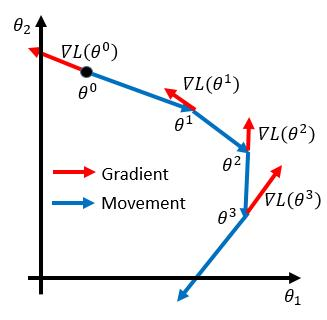
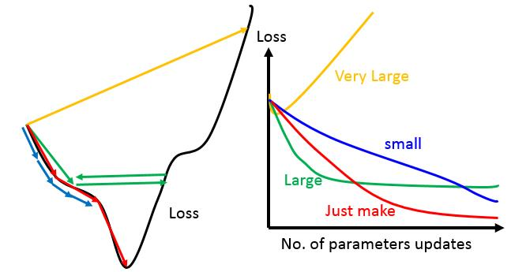
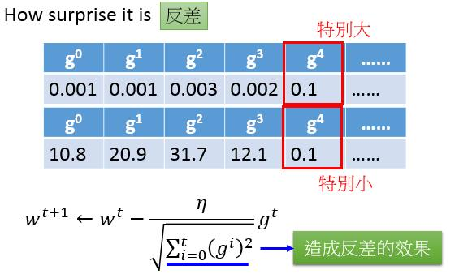
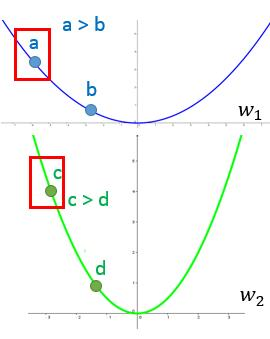
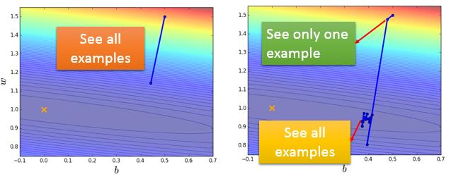
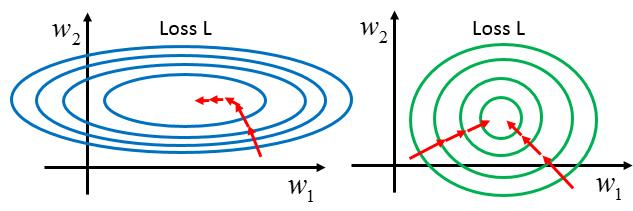
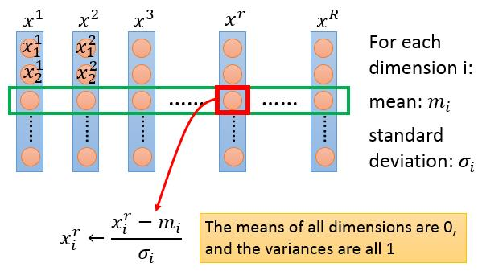
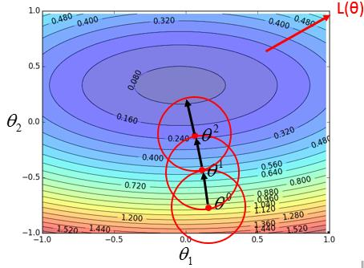
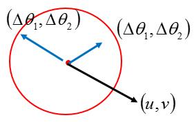

# Effective Gradient Descent

\[[lecture](../lectures/gradient_descent.pdf)\]
\[[video](https://www.bilibili.com/video/av10590361/#page=4)\]

<!-- TOC -->

- [Effective Gradient Descent](#effective-gradient-descent)
    - [Tuning your learning rates](#tuning-your-learning-rates)
    - [Stochastic Gradinet Descent](#stochastic-gradinet-descent)
    - [Feature Scaling](#feature-scaling)
    - [Gradinet Descent Theory](#gradinet-descent-theory)

<!-- /TOC -->

在Note1中，我们已经通过宝可梦的例子介绍了怎么使用梯度下降来求解损失函数的最小化问题，但在那里我们只是简单的列出了做梯度下降的关键3个步骤，没有进一步阐明，为什么梯度下降可以Work，以及使用梯度下降可能会遇到什么问题，这些问题如何解决，这篇文章将回过头来一一阐述。

我们先回顾一下，在机器学习第3步中，我们如何使用梯度下降来求解损失函数的最小值问题。我们的问题数学表达是：

$$\theta^* = arg\min_{\theta}L(\theta)$$
其中$L$是我们定义的评价函数（损失函数），$\theta$是模型的参数。我们希望找到$\theta^*$使得$L$达到最小。

假设我们$\theta$是一个二维的向量，有两个参数$\{\theta_1, \theta_2\}$

第一步，我们随机初始化$\theta = \theta^0 = \begin{bmatrix}\theta_1^0 \\ \theta_2^0\end{bmatrix}$

第二步，计算$L(\theta)$在$\theta^0$处对$\theta$的偏导数$\nabla L(\theta) = \begin{bmatrix}\nabla L(\theta_1^0)\\ \nabla L(\theta_2^0)\end{bmatrix}$

第三步，更新$\theta$：$\theta^1 = \theta^0 - \eta \nabla L(\theta1^0)$

第四步：重复迭代第二步与第三步，经过n的迭代后，最终求得$\theta^n$

上面的步骤也可以用可视化的方法表达如下：

## Tuning your learning rates

如果我们在note1中实际用梯度下降的方法去求解一个最优化问题，我们就会发现，如何选择合适的learning rate是一个很头疼的问题，你很可能需要多次的尝试才能找到一个合适的learning rate。如果不恰当的选择learning rate会遇到什么问题呢？

- 如果learning rate太小（如下图蓝色细条），模型参数每一次迭代更新的就很慢，我们需要很次的迭代才能达到一个较好的效果。当然这种情况，除了多花点时间，也没什么大的问题。
- 如果learning rate太大（如下图的绿色和黄色的线），模型参数每次更新幅度很大，在接近极小值时，就很容易越过去，而且当learning rate太大时，还会造成整个Loss越来越大（需要思考为什么）。

在实验时，由于我们的模型往往有很多的参数，所以我们不太可能画出上面左边的图像，但是我们可以画出随着迭代次数，整个模型在训练集上的error的变化情况，如上图中右边所示，根据变化的趋势来判断我们选择的learning rate是否合适。

既然选择合适的learning rate这么重要，那有没有一些自动化的方法来自动的调整learning rate呢。有！而且有很多种，针对learning rate的调整学术界已经提出了很多种方法，比如：有基于Moment的方法Nesterov，也有基于所有参数有不同学习率的Adagrad方法。也有将两者融合在一起的Adam方法。这里先只按照Lecture介绍一下Adagrad，有机会，会把其他的方法也补充过来。

[TODO]把其他几种参数更新的方法也加以说明

Adagrad的两个核心思想

- 随着迭代次数越来越多，我们逐步的减少learning rate，因为在刚开始，我们随机初始化模型参数，这时候往往距离最优解还比较远，我们可以用较大的learning rate来快速到达最优解的附近，然后再用较小的learning rate慢慢的接近最优解。
- 对所有不同的参数，我们给它们不同的学习率。

所以Adagrad的参数更新方法如下：

$$\theta^{t+1} = \theta_t - \frac{\eta^t}{\sigma^t}g^t$$
$$\eta^t = \frac{\eta}{\sqrt{t+1}}, \sigma^t = \sqrt{\frac{1}{t+1}\sum_i^t g^i}$$

其中$g^t$是第t次迭代$L(\theta)$的梯度，$t$是迭代次数。经过化简后，我们可以得到

$$\theta^{t+1} = \theta_t - \frac{\eta}{\sqrt{\sum_i^t g^i}}g^t$$

如果你仔细看上面的式子，你可能会有一个疑问，根据梯度下降算法，梯度越大，往往意味着离最优解越远，我们应该选择较大的更新步长，但从上面的公式中中看到分母项为$\sqrt{\sum_i^t g^i}$，里面包含了当前点的梯度。如何解释这种设计？

直觉上的解释，这样的设计可以抑制一些梯度的波动（为什么会产生梯度波动，以及梯度波动有什么 不好？）情况。

另外一种解释从：我们要对“梯度越大，就说明我们离极植点越远”这句话的正确性进行一下验证。

上面是损失函数关于$w_1$和$w_2$的变化曲线，先看蓝色曲线上的2个点a和b,a点的梯度值是大于b点的梯度值的，a点离极值点比b点更远。结论成立，同样看绿色曲线上的c和d两点，结论也同样成立。但是如果我们对比a点和c点，c距离极植点比a要近，但是c点的梯度值比a点的梯度值要小。

所以**Larger $1^{\text{st}}$ order derivative means far from the minima**这句话是不对的。在不同参数上就不成立。

那距离minia的远近可以用什么来评估呢？我们怎么确定最佳的步幅呢，如果学习过牛顿法，或者其他二阶优化算法，就可以知道，最好的step是一阶层数/二阶导数。

我们的Adagrad的形式可以看作为一阶梯度/二阶梯度的近似。

## Stochastic Gradinet Descent

回顾一下我们线程回归模型的评价函数的形式为：

$$L = \sum_n\left(\hat{y}^n - (b + \sum w_ix_i^n)\right)^2$$

当我们的数据量很大时，计算L的梯度值是一个非常耗时的事件，导致我们每迭代一次都需要较长的时间。

Stochactic Gradinet Descent提出来一次迭代只使用一个样本计算梯度，对应的损失函数变为了：

$$L = \left(\hat{y}^n - (b + \sum w_ix_i^n)\right)^2$$

很明显这样速度更快，很多人在这里就产生了疑问，这样能有效吗？可以做这样的简化吗？答案是肯定的，至于为什么？有机会单独解释。

[TODO]解释为什么随机梯度下降会有效。

下面是使用梯度下降和随机梯度下降的示例，在梯度下降中，使用20个训练样本只更新了一次参数，而右图显示了在随机梯度下降中使用了20个样本进行了20次的迭代，虽然会产生波动，但总体的方向是对的。

## Feature Scaling

Feature Scaling是机器学习中一种常见的数据预处理方法，它的主要想法是让数据的每个特征维度都尽可能的在一个尺度上。

当不同特征之间的scale相差比较大时，直接使用梯度下降，会遇到很多训练上的问题，比如收敛慢，容易振荡等。下图展示了，两种情况下梯度下降中可能的参数更新轨迹。

那具体怎么来做Feature Scaing呢，一句话概括：减均值，除方差。但这里要注意的是我们操作的对像是很多个feature vector。

## Gradinet Descent Theory

无论是note1还是本个note的上面的部分，都回避了一个问题就是，为什么我们选择梯度反方向作为我们参数更新的方向，有没有比这个方向更好的，下降速度更快的方向呢？

从梯度下降的第二步开始，我们在随机的选择了一个参数后，我们怎么来找下一步应该往哪个方向更新呢，更新多少呢？如果大家熟悉的下山作为类比，我们站在山上的某位置上，我们需要找到最快的下山路径。

不如从脚下从发，从眼下的一个小区域开始，我们很容易找到附近的一个小区域内那个损失函数最小的点，然后我们把参数朝那个方向移动。当到达一个新的位置后，我们再次考虑附近的一个小的邻域，找到邻域内最小的点，再次更新。就这样一步一步的，我们会慢慢的接近极值点。

对于我们的损失函数$L(\theta)$，在位置$\theta^0$处，我们如何找到$\theta^0$附近的一小范围内的极值呢，我们使用Taler展开，把$L(\theta)$在$\theta^0$处用一个多项式函数进行逼近，把问题转化为求一个多项式函数的极植，这样就容易多了。

$$L(\theta) = L(\theta^0) + \frac{\partial L(\theta^0)}{\partial \theta_1}(\theta_1 - \theta_1^0) + \frac{\partial L(\theta^0)}{\partial \theta_2}(\theta_2 - \theta_2^0) + \cdots$$

在我们选定的一个小范围内$(\theta-\theta^0_1)^2+(\theta-\theta^0_1)^2\le d^2$，我们需要找到能使上面的式子的值最小。

我把用$u,v$来表示$\frac{\partial L(\theta^0)}{\partial \theta_1}, \frac{\partial L(\theta^0)}{\partial \theta_2}$， 用$\Delta\theta_1,\Delta\theta_2$来表示$\theta-\theta^0_1,\theta-\theta^0_2$，那我们问题转化为

$$arg\min_{\Delta\theta} (u\Delta\theta_1 + v\Delta\theta_2), \Delta\theta_1^2 + \Delta\theta_2^2\le d^2$$

很容易得到$\Delta\theta_1,\Delta\theta_2$应该和$u,v$反向。所以我们梯度下降中选择的方向就是梯度方向。学习率$\eta$实际上是控制了我们选择了那个邻域的大小，所以如果learning rate选择太大，梯度下降算法从原理上讲就失效了。

