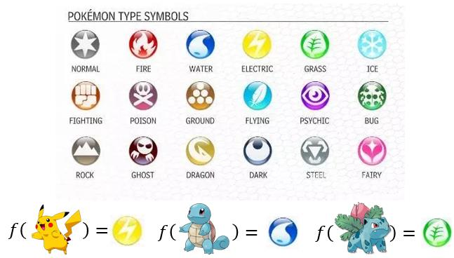

# Classification: Probabilistic Generative Model

\[[lecture](../lectures/classification_and_generative_model.pdf)\]
\[[video](https://www.bilibili.com/video/av10590361/#page=5)\]

<!-- TOC -->

- [Classification: Probabilistic Generative Model](#classification-probabilistic-generative-model)
    - [Classification](#classification)
    - [Tow Box](#tow-box)
    - [Two Class](#two-class)
    - [Probability of Feature](#probability-of-feature)
    - [Maximum Likelihood](#maximum-likelihood)
    - [Result](#result)
    - [Same Sigma](#same-sigma)
    - [Naive Bayes Classifier](#naive-bayes-classifier)
    - [Linear Model interpretation](#linear-model-interpretation)

<!-- /TOC -->

在这前的笔记本已经介绍了回归问题，并介绍了用机器学习问题的解决框架来解决宝可梦进化后CP值的回归问题。这篇笔记将介绍机器学习中另一个很重要的TASK：分类。

## Classification

在机器学习介绍的笔记本已经大概介绍了分类问题的特点，与回归问题相比，它的输出是一个类别标签。分类问题在现实中也是很常见的问题，例如：
- 贷款信用判定
    - 输入：一个人的收入、存款、职业、年龄、过去的财务状态等信息
    - 输出：是否接入贷款申请
- 医学诊断
    - 输入：病症、年龄、性别、病史等
    - 输出：哪一种疾病
- 手写字符识别
    - 输入：手写字符的图片数据
    - 输出：哪一个字符
- 图片识别
    - 输入：图片数据
    - 输出：图片中的事物属于哪一个类别

还是让我们用宝可梦的问题来作为本节课程的一个实例！在本节中我们将通过研究宝可梦属性的分类问题来介绍如何用概率生成模型求解分类问题。

我们已知的每一种宝可梦都有一个属性类别：水系、火系、草系、正常等等。那我们如何根据一个宝可梦的一些战斗特点来判断一个宝可梦的属性呢？

首先我们需要先将每一个宝可梦的战斗属性抽象成一个特征向量，用这个特征向量来表示这个宝可梦的输入。比如[HP,Attack,Defencse,SP Atk, SP Def, Speed]用这6个战斗属性就可表示了一只宝可梦，我们根据这些战斗属性值来判断每只宝可梦属于哪一个类别。

其次，我们需要有很多的宝可梦的战斗属性值数据和它对应的种类作为我们的训练数据集。

我们先思考，能不能像之前做回归那样呢，我们把宝可梦的类别$\hat{y}$用一个数字来表示，比如有2个类别的宝可梦，我们分别用$+1, -1$来表示。然后我们去找一个线性回归的Model:$y = w\cdot x + b$，让y来逼近$+1$或$-1$。如果一只宝可梦的输出的结果$y$接近于-1就属于第一类，反之则属于第二类。

如果我们按回归的方式去求解一个分类问题，会遇到一个问题，就是当某一个类别中出现了一些离群点时，就造成这个类别分类效果很差。如下图所示：

上图在右下解的那些蓝色的点，因为离群了，造成了回归模型必须去考虑这些点的输出值要接近于1。导致原本那些蓝色的点分类效果就变差。

> Penalize to the examples that "too correct" [Bishop, P186]

上面是从二分类的角度来看如果用回归的模型去做分类问题可能存在的问题，那如果是一个多分类的问题呢。回归问题中如果两个输入的预测值比较接近，说明了两个输入存在着一种相似的关系。但是这对于多分类来多说完全没有意义，预测为类别1的宝可梦和预测为类别2的宝可梦之间存在什么样的关系，它们和预测类别为10的宝可梦之间有什么关系，这些我们都是不关心的。

那理想的一个分类的模型应该是什么样子呢？

先从二分类的情况讲起。

我们希望我们选择的模型$f$，可以让输入$x$，经过变换$g(x)$后，得到一个大于0或小于0的值，通过这样来判断输入的宝可梦属于哪一类。

$$
f(x) = 
\begin{cases} \text{class 1, if   } g(x) >0 \\
\text{class 2, else   }
\end{cases} 
$$
我们的损失函数即为判断正确的样本的个数。只关心样本分类的对与错，而不关心错了多远。

$$L(f) = \sum_n\delta(f(x^n)\neq \hat{y}^n)$$

## Tow Box

在介绍我们的概率生成模型前，我们先回顾一下一个简单的概率问题：有两个盒子，每个里面装的都有蓝球和绿球。现在我两个盒子中间的一个里面随机取出一个球，有下面几个问题：
1. 这个球来自Box1的概率是多大？
2. 取的球是蓝球的概率是多大？
3. 从Box1中随机取一个球，蓝球的概率有多大？
4. 如果我已经知道取的球是蓝球，那它来自Box1的概率是多大？

上面的几个问题都很基础，我们用数学符号把它们表示出来：

1. $P(Box1) = 1/2$，两边的球的个数一样
2. 蓝球可能来自于Box1，也可能来自Box2，它的概率为$P(Blue|Box1)P(Box1) + P(Blue|Box2)P(Box2) = 3/5$
3. $P(Blue|Box1) = 4/5$
4. $P(Box1|Blue) = \frac{P(Blue|Box1)P(Box1)}{P(Blue|Box1)P(Box1) + P(Blue|Box2)P(Box2)} = 2/3$

## Two Class

回到我们二分类问题上来，把上面的两个盒子换成我们要做的二个类别（水系宝可梦和普通宝可梦），每个类别里都有一些不同的宝可梦，用$x$表示。

由于水系的宝可梦与普通宝可梦数量上可能不同，所以随机出现的一只宝可梦属于两个类别的概率也不一样，分别记为$P(C_1)$和$P(C_2)$，对于给定的一只宝可梦$x$，它可能来自于C1也可能来自于类C2，在类别1中出现的概率为$P(x|C_1)$，在类别2中出现的概率为$P(x|C_2)$，那我们想求的是给于$x$，这到底来自于C1还是C2。

我们可以通过比较它来自类别1的概率值$P(C_1|x)$与来自类别2的概率值$P(C_2|x)$来判断。如果$P(C_1|x)$大于$P(C_2|x)$则$x$属于C1，反之属于C2。如何计算$P(C_1|x)$呢？（二分类问题中$P(C_2|x) = 1- P(C_1|x)$）

由上个部分的分析我们知道：

$$P(C_1|x) = \frac{P(x|C_1)P(C_1)}{P(x|C_1)P(C_1) + P(x|C_2)P(C_2)}$$

观察上面的式子，$P(C_1)$和$P(C_2)$我们可以通过，计算两个类别宝可梦的数量进行计算：

$$P(C_1) = \frac{N_1}{N_1+N_2},P(C_2) = \frac{N_2}{N_1+N_2}$$

我们的关键任务是求$P(x|C_1)$和$P(x|C_2)$，我们是否也可以通过频率的方法来求出来C1中出现了多少个$x$呢？实际上，往往会出现$x$从来没有在C1中出现的可能,但从战斗属性值上来看，$x$与C1中的宝可梦比较接近，不能说$P(x|C_1) = 0$。

于是我们就把$x$当作$[x_{hp},x_{def},\cdots]$一个向量来考虑，考虑这个向量属于C1的概率。

## Probability of Feature

我们可以对C1中所有的样本的特征进行统计建模，用一个统计模型来表示一个特征向量$x$属于模型的概率。简化起见，我们这里先只考虑二维的情况，我们选择了宝可梦的二个战斗属性值，Defense和SP Defense，把每个宝可梦都用这样一个二维特征向量来表示。我们把C1中的所有样本（这里有79个样本）的特征微量可视化如下：

我们这里选择二维高斯统计模型对C1中的79个宝可梦的特征向量进行建模，如图中红色椭圆所示。有了这个模型后，我们就可以评估坐标中任何一个点（代表一只宝可梦的特征向量）属于C1的概率。我们用的高斯模型为：

$$f_{\mu,\Sigma}(x)=\frac{1}{(2\pi)^{D/2}}\frac{1}{|\Sigma|^{1/2}}\exp{\{-\frac{1}{2}(x-\mu)^T\Sigma^{-1}(x-\mu)\}}$$

其中$\mu$为模型的均值，$\Sigma$为协方差，它是模型的参数，决定了高斯分布的样子，怎么根据一个类别里的样本，求$\mu$和$\Sigma$呢？

## Maximum Likelihood

最大似然估计是统计学中常用的根据已经样本，估计分布参数的方法，当我们有一个产生样本的分布$f$时，我们希望我们已经有的样本在该分布中出现的概率越大越好。对于我们宝可梦的问题，我们要估计二维高斯分布的均值，和方差，我们计算该分布在79个样本上的似然为：

$$L(\mu,\Sigma) = f_{\mu,\Sigma}(x^1)f_{\mu,\Sigma}(x^2),\cdots,f_{\mu,\Sigma}(x^{79})$$

我们求解的问题为

$$\mu^*,\Sigma^* = \arg\max_{\mu,\Sigma}L(\mu,\Sigma)$$

根据统计中原来学过的知识，我可直接写出它的最优解为：

$$\mu^* = \frac{1}{79}\sum^{79}_n x^n, \Sigma^* = \frac{1}{79}\sum^{79}_n(x^n-\mu^*)(x^n-\mu^*)^T$$

根据上面的讨论，我们很容易的求出了，水系神奇宝贝和正常系神奇宝贝关于特征向量的分布模型。

## Result

到现在为止，我们已经解决了$P(x|C_1)$和$P(x|C_2)$的问题，下就可以把它们代入公式进一步求解出$P(C_1|x)$

$$P(C_1|x) = \frac{P(x|C_1)P(C_1)}{P(x|C_1)P(C_1) + P(x|C_2)P(C_2)}$$

如果$P(C_1|x)>0.5$，那么$x$就属于$C_1$，我们实际上跑了一下实验，得到了如下的结果，最终的分类准确率为47%。

结果让我们失望，如果我们瞎猜，理论上都有50%的准确度，可见我们学习出来的模型完全没有用。经过思考，有可能是因为我们选择的特征的问题，我们只选择了[Defense，SP Defense]二维特征向量来表示一个宝可梦，如果选用更多的特征呢。实验后，我们得到了64%的准确率，也一般般，比瞎猜好一些。

## Same Sigma

在上面求$P(x|C_1)$和$P(x|C_2)$时，我们为每一类的样本分别求$\mu$和$\Sigma$，参数比较多，如果我们在这里做一下简化，把C1的$\Sigma_1$与C2的$\Sigma_2$，只用参数$\Sigma$表示，达到简化整个模型的效果，效果如何呢。

我们还是通过最大似然法来求解我们的模型参数。

$$L(\mu_1,\mu_2,\Sigma) = f_{\mu_1,\Sigma}(x^1)f_{\mu_1,\Sigma}(x^2),\cdots,f_{\mu_1,\Sigma}(x^{79})\times f_{\mu_2,\Sigma}(x^{80})f_{\mu_2,\Sigma}(x^{81}),\cdots,f_{\mu_2,\Sigma}(x^{140})$$

与之前的参数相比，我们求到的$\mu_1,\mu_2$都没有变化，而$\Sigma = \frac{79}{140}\Sigma_1 + \frac{61}{140}\Sigma_2$

新的模型表现如何呢？实验结果显示得到了73%的准确率，这已经是一个很好的结果了。更重要的是，决策边界的可视化，这时，我们的决策边界变成一线性的。这一点我们在最后一部分解释。

## Naive Bayes Classifier

让我们回到$P(x|C_1)$和$P(x|C_2)$的求解上来，在上面的求解过程中，我们做了一个假设，就是C1与C2中的样本都服从了高斯分布。如果我们把假设加强，C1中的样本$\{x^1,x^2,\cdots,x^n\}$不光服从高斯分布，而且对于任何样本$x$，它特征的每个维度彼此独立，那么就有：

$$P(x|C_1) = P(x_1|C_1)P(x_2|C_1)\cdots P(x_k|C_1)\cdots$$

其中每个分量$P(x_k|C_1)$都是一个一维的高斯分布。

如果$x_k$是一个二值的特征，表示有或无，那$P(x_k|C_1)$则服从Bernoulli分布。

有这样的假设前提下，我们的分类模型就是Naive Bayes Classifier.

## Linear Model interpretation

现在来做一些数学上的公式推导，来证明在上面我们找到的那个分类模型$P(C_1|x)$实际上就是一个线性的模型。

令

$$z= \ln\frac{P(x|C_1)P(C_1)}{P(x|C_2)P(C_2)}$$

则有

$$P(C_1|x) = \frac{P(x|C_1)P(C_1)}{P(x|C_1)P(C_1) + P(x|C_2)P(C_2)}$$
$$ = \frac{1}{1 + \frac{P(x|C_2)P(C_2)}{P(x|C_1)P(C_1)}} = \frac{1}{1+\exp(-z)} = \sigma(z)$$

我们继续对$z$做一些推导

$$z = \ln\frac{P(x|C_1)P(C_1)}{P(x|C_2)P(C_2)} = \ln\frac{P(x|C_1)}{P(x|C_2)}+\ln\frac{\frac{N_1}{N_1+N_2}}{\frac{N_2}{N_1+N_2}}$$
$$\ln\frac{P(x|C_1)}{P(x|C_2)} = \ln\frac{|\Sigma_2|^{1/2}}{|\Sigma_1|^{1/2}} + \left[-\frac{1}{2}(x-\mu_1)^T\Sigma_1^{-1}(x-\mu_1) + \frac{1}{2}(x-\mu_2)^T\Sigma_2^{-1}(x-\mu_2)\right]$$

$$(x-\mu)^T\Sigma^{-1}(x-\mu) = x^T\Sigma^{-1}x - x^T\Sigma^{-1}\mu-\mu^T\Sigma^{-1}x+\mu^T\Sigma^{-1}\mu = x^T\Sigma^{-1}x - 2x^T\Sigma^{-1}\mu+\mu^T\Sigma^{-1}\mu$$

综合上面三个等式，我们可以把$z$表示为

$$z = \ln\frac{|\Sigma_2|^{1/2}}{|\Sigma_1|^{1/2}} - \frac{1}{2}x^T\Sigma_1^{-1}x + x^T\Sigma_1^{-1}\mu_1-\frac{1}{2}\mu_1^T\Sigma_1^{-1}\mu_1+\frac{1}{2}x^T\Sigma_2^{-1}x - x^T\Sigma_2^{-1}\mu_2+\frac{1}{2}\mu_2^T\Sigma_2^{-1}\mu_2 + \ln\frac{N_1}{N_2} $$

如果我们像之前那样使得$C_1,C_2$共用一个$\Sigma$，那么上面的式子就化简为：

$$z = (\mu_1-\mu_2)^T\Sigma^{-1}x -\frac{1}{2}\mu_1^T\Sigma^{-1}\mu_1 + \frac{1}{2}\mu_2^T\Sigma^{-1}\mu_2 + \ln\frac{N_1}{N_2}$$

也就是$z = w\cdot x+ b$，$P(C_1|x) = \sigma(w\cdot x+ b)$

转了一大圈，实际上我们就是在求$w,b$，那为什么我们不直接求呢，下一个Note我们就来介绍。