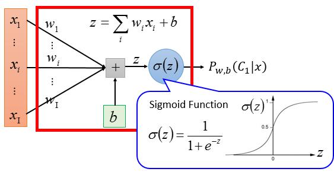
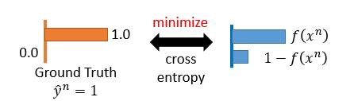
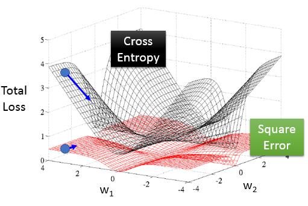
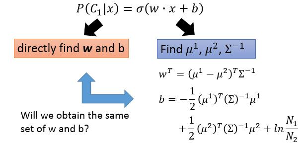
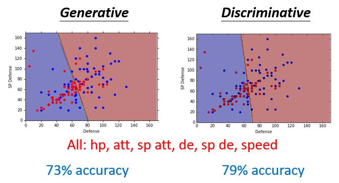
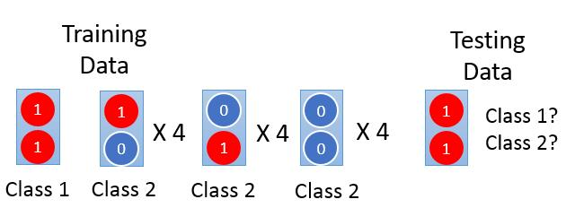
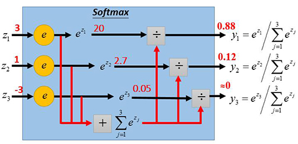
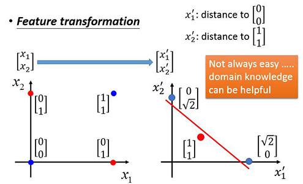
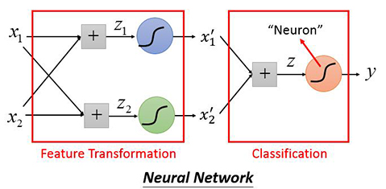

# Classification: Logistic Regression

\[[lecture](../lectures/logistic_regression.pdf)\]
\[[video](https://www.bilibili.com/video/av10590361/#page=6)\]

<!-- TOC -->

- [Classification: Logistic Regression](#classification-logistic-regression)
    - [Goodness of a Function](#goodness-of-a-function)
    - [Find the best Function](#find-the-best-function)
    - [If use square error](#if-use-square-error)
    - [Generative v.s. Discriminative](#generative-vs-discriminative)
    - [Softmax](#softmax)
    - [Feature Transformation](#feature-transformation)

<!-- /TOC -->

在上一讲的笔记的最后，我们用概率生成模型最终到了二分类问题的Function Set为

$$P(C1|x) = \sigma(z)$$
$$z = w\cdot x+b = \sum_iw_i x_i+b$$
$$\sigma(z) = \frac{1}{1+\exp(-z)}$$

我们通过判断有如下的差别方法

$$\begin{cases} P_{w,b}(C_1|x)\ge 0.5 \ \ \text{ class1} \\
P_{w,b}(C_1|x) < 0.5 \ \ \text{ class2}
\end{cases}$$

所有的$w,b$决定的所有函数构成了我们的Fucntion Set。

我们可以用以下的图示，把我们的Function Set表示出来：



## Goodness of a Function

既然我们已经知道了Funcstion Set的形式，这里我们不再像上个note那样，通过直接对每类数据进行分布参数的求解，而是直接求$w$和$b$。这种方法我们称为**判别式学习算法**。

对于一个训练集$\{(x^1,C_1),(x^2,C_1),(x^3,C_2),\cdots\}$，我们可以用$\hat{y}=1$或$\hat{y}=0$来表示数据是属于$C1$还是$C_2$。那么我们的训练数据就变成了$\{(x^1,\hat{y}^1),(x^2,\hat{y}^2),(x^3,\hat{y}^3),\cdots\}$

我们假设所有的训练数据都是从$P(\hat{y} = 1|x)$和$P(\hat{y} = 0|x)$两个概率分布产生的，那么我们就可以利用最大似然的方法来求解参数。

$$L(w,b) = f_{w,b}(x^1)f_{w,b}(x^2)(1-f_{w,b}(x^3))\cdots)$$
$$w^*,b^* = \arg\max_{w,b}L(w,b) = \arg\min_{w,b}-L(w,b)$$
$$\arg\min_{w,b}-L(w,b) = \arg\min_{w,b}-\ln L(w,b)$$

我们可以对上面的式子做以下的推导：

$$-\ln L(w,b) = -\ln f_{w,b}(x^1) -\ln f_{w,b}(x^2) -\ln(1- f_{w,b}(x^3))\cdots$$

由于对于类别1的样本与类别2样本，它们在似然函数中的形式不统一，所以我们进行了如下的变化，让他们的表达式统一：

$$-\ln L(w,b) = -[\hat{y}^1\cdot \ln f(x^1) + (1-\hat{y}^1)\ln (1-f(x^1))]$$
$$-[\hat{y}^2\cdot \ln f(x^2) + (1-\hat{y}^2)\ln (1-f(x^2))]$$
$$-[\hat{y}^3\cdot \ln f(x^3) + (1-\hat{y}^3)\ln (1-f(x^3))]-\cdots$$
$$=\sum_n-[\hat{y}^n\cdot \ln f(x^n) + (1-\hat{y}^n)\ln (1-f(x^n))]$$

而$-[\hat{y}^n\cdot \ln f(x^n) + (1-\hat{y}^n)\ln (1-f(x^n))]$ 实际上就是Bernoullli分布的cross entropy。



## Find the best Function

在第二步中，我们最大似然定义了损失函数，这一步我们就利用梯度下降法对损失函数进行最优化求解。关于梯度下降的步骤，我们就不再重复讲解了，我们的优化目标函数是

$$-\ln L(w,b) = \sum_n-[\hat{y}^n\cdot \ln f(x^n) + (1-\hat{y}^n)\ln (1-f(x^n))]$$
$$f(x) = \frac{1}{1+\exp(wx+b)})$$

在梯度下降中，我们要求解的是$\frac{\partial -\ln L(w,b)}{\partial w}$和$\frac{\partial -\ln L(w,b)}{\partial b}$

$$\frac{\partial f(x)}{\partial w_i} = \frac{\partial f(x)}{\partial z}\frac{\partial z}{\partial w_i} = f(x)(1-f(x))\cdot x_i$$

$$\frac{\partial -\ln L(w,b)}{\partial w_i} = \sum_n-[\hat{y}^n\frac{1}{f(x^n)}\frac{\partial f(x^n)}{\partial w_i} + (1-\hat{y}^n)\frac{-1}{1- f(x^n)}\frac{\partial f(x^n)}{\partial w_i}]$$
$$ = \sum_n[\hat{y}^n(1-f(x))\cdot x_i+(1-\hat{y}^n)(-f(x))\cdot x_i] = \sum_n[(\hat{y}^n - f(x))\cdot x_i]$$

$$\frac{\partial -\ln L(w,b)}{\partial b_i} =\sum_n(\hat{y}^n - f(x)) $$

从上面推导出来的梯度的结果来看，是非常符合直觉的，$f(x)$与$\hat{y}$之是的差距越大，说明我们的预测值离真实值差距较大，则梯度越大。

## If use square error

很多人包括我自己在学习Logistric Regression的时候都会问题，为什么选择了交叉熵这样的奇怪的损失函数，而没有选择平方损失函数呢

$$L(w,b) =\sum_n(f_{w,b}(x^n)-\hat{y}^n)^2$$

而且在《机器学习》这本书中，介绍神经网络的时候，对于输出层的损失也是用平方损失。

这一小节，我们来看一下，在logistic中如果用square error会有什么问题。我们不妨对square error的损失函数求一下梯度。

$$\frac{\partial L(w,b)}{\partial w_i} = \sum_n 2(f_{w,b}(x^b) - \hat{y}^n)\frac{\partial f_{w,b}(x^n)}{\partial w_i} =2(f_{w,b}(x^b) - \hat{y}^n)f_{w,b}(x^n)(1-f_{w,b}(x^n))x_i $$

我们看一下当$\hat{y} = 1$而我们的预测结果$f(x)$确很小，接近于0的时候。由于预测值离目标还很远，我们希望有较大的梯度来更快的接近极值点。可是，对于square error的梯度来说，这时整个梯度接近于0。

通过下面的图像，我们可以对square error的损失函数与cross entropy的损失函数有一个直观的对比。




## Generative v.s. Discriminative

在前面小节里，提到过Logistic regrssion是一个送别模型，现在回过头让我们看一下，判别模型和生成式模型到底有什么不同。



虽然是相同的训练数据，但是由于我们求$w,b$的方法不同，最终得到的结果也是不一样的。



举个例子来说明生成式模型与判别式模型在分类问题上的一些差异。一共有13笔training data，其中每个笔data有都两个分量组成，每个分量可能为1或0，共有2个类别。测试数据是一个[1,1]的数据。如下图所示：



我们用朴素贝叶斯方法（生成式学习算法）来判断testing data属于哪个类别，我们计算测试数据$x$属于类别1的概率。

$$P(C_1|x) = \frac{P(x|C_1)P(C_1)}{P(x|C_1)P(C_1) + P(x|C_2)P(C_2)} < 0.5$$

从结果看来，朴素贝叶斯判断我们的测式数据属于类别2,这多少有点违反我们的直觉。因为训练数据中有一个和测试数据一模一样的数据，类别为1。

怎么解释生成算法出来的这个现象呢：由于贝叶斯算法的的一个假设是每个样本特征的各个维度是彼此独立的。那如果我们重新看训练集中的类别为2的样本的两个分量，就容易发现，基于各分量独立的前提，类别2中是很有可能有[1,1]这种数据的，可能只是我们拿到的training data正好没有而已。

对于判断式算法和生成式算法一般有如下的结论：
- 人们往往会更相信判别模型的效果会更高一些
- 但生成式模型有下面的好处：
    - 生成式模型都会有一个概率假设前提，这样的话，会只需要少量的数据，而且对噪声更robust。
    - 我们可以通过不同的数据集，来估计样本的条件独立的每个维度的概率值。

## Softmax

之前我们讨论的都是二分类的问题，现在我们到多分类问题上面来，对于多分类的问题，对于输入$x$，我们找到最大的$P(C_i|x)$来判断$x$属性哪一类。如何求$P(C_i|x)$呢，我们像二分类一样，把每一类的样本都想像为一个高斯分布$(\mu,\Sigma)$产生的，但每个类的分布是相同的$\Sigma$。用最大似然估计，来求出解$\mu$和$\Sigma$，则

$$P(C_i|x) = \frac{P(x|C_i)P(C_i)}{\sum^K_n P(x|C_n)P(C_n) }$$

最终与二分类类似的推导，我们会得到下面的结果：

$$z^i = w^i\cdot x+ b$$
$$P(C_i|x) = \frac{\exp(z^i)}{\sum^K_n \exp(z^n)}$$

其中$w,b$是$\mu,\Sigma$来表示。

我们用一个实际的数值示例来说明softmax的实际计算过程。



Softmax的数值问题：softmax里出现了指数函数，通过会造成很大的数值，在计算的时候容易出来溢出而不稳定。我们可以使用一些規一化的技巧来避免这个问题。

$$\frac{\exp(z^i)}{\sum^K_n \exp(z^n)} = \frac{C\cdot \exp(z^i)}{C\cdot\sum^K_n \exp(z^n)} = \frac{\exp(z^i\cdot \ln C)}{\sum^K_n \exp(z^n\cdot \ln C)}$$

我把C设置为$\max\{z_i\}$

```python
# python 示例，来自CS231n
f = np.array([123,456,789])# 例子中有3个分类，每个评分的数值都很大
p = np.exp(f)/np.sum(np.exp(f))# 不妙：数值问题，可能导致数值爆炸
# 那么将f中的值平移到最大值为0：
f -= np.max(f)# f becomes [-666, -333, 0]
p = np.exp(f)/np.sum(np.exp(f))# 现在OK了，将给出正确结果
```

由交叉熵的定义，我们定义Softmax的损失函数为

$$-\sum_n\hat{y}^n\ln y^n$$

## Feature Transformation

通过logistic regression的Function set就知道，它只是一个线性分类器，所以只它能解决 样本是线性可分的问题，如果样本数据线性不可分，那就无能为力了。

x1 | x2 | label
---|---|---
0|0|class2
0|1|class1
1|0|class1
1|1|class2

这时候，我们可以先对数据做一些变化，称之为特征变化。



但是当我们的数据维数很高时，我们很难找到这种特征变化的显式的函数，我们可以通过级联Logitic regression来做这件事。这就是我们后面要讲到的Neural Network。

