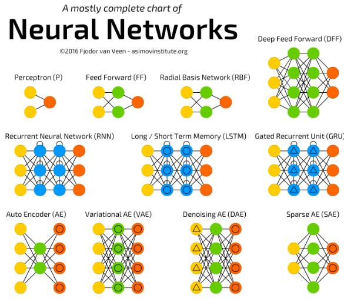

# Introduction to Deep Learning

\[[lecture](../lectures/deeplearning_intro.pdf)\]
\[[intro video](https://www.bilibili.com/video/av10590361/#page=7)\]
\[[backprogation video](https://www.bilibili.com/video/av10590361/#page=8)\]

终于来到了激动人心的章节！深度学习这个词，不需要过多的解释，大家都已经耳熟能详了，从2006年到现在，尤其是AlphaGo的延生，让深度学习在整个星球上热了起来。这个Note将给大家介绍这门技术。

## Ups and downs of Deep Learning

Deep Learning如此的火热，吸引了全世球那么多人的注意力，DeepLearning正在引领多个领域的变革，它不是一个靠吹捧出来的技术，而是实实在在的渗透到各个应用上。下面我们从2012年到2016年Google内部用于Deep Learning技术的项目的个数变化曲线。

从图上可以看出来，Deep Learning的应用正在成指数型的增长。

但如果回头来看DeepLearning的整个发展历程来看，并不是一帆风顺的，虽然Deep Learning这个词是2006年左右被定义出来，但它的相关技术早在60年代就发展出来了。

- 1958: Perceptron (linear model)
- 1969: Perceptron has limitation：只能处理线性可分的问题，没有激活单元
- 1980s: Multi-layer perceptron ：Do not have significant difference from DNN today
- 1986: Backpropagation： Usually more than 3 hidden layers is not helpful
- 1989: 1 hidden layer is “good enough”, why deep?，这个质疑让多层感知机失去了发展动力
- 2006: RBM initialization
- 2009: GPU
- 2011: Start to be popular in speech recognition
- 2012: win ILSVRC image competition 
- 2015.2: Image recognition surpassing human-level performance 
- 2016.3: Alpha GO beats Lee Sedol
- 2016.10: Speech recognition system as good as humans

# Three steps for deep lerning

让我们用之前定义的机器学习的三个步骤来学习深度学习，看一下深度学习在这三个方面是如何做的。

在上一个note的最后部分，我们定义了一种级联的logstic regression结构，而且也说到了这种结构就是deep learning的结构。确实如此！

深度学习中的网络结构我们称之为：“神经网络”（Neural Network）。它就由一个个logistic regression单元（这里我们称之为神经元Neuron）来组成的一个图结构。

我们可以定义不同的图结构来形成不同类型的神经网络，常听说的有：DNN、CNN、RNN等。它们都是因为神经元之间联结方式不同而形成的。一旦我们选择好了一个神经网络的结构，实际上我们就定义好了一个Function Set。

我们先从最简单的神经网络结构开始：Fully Connect Feedforward Network。

全连结的前馈神经网络从组成上来说分成两种组成部分：神经元与层，其中层是由神经元构成的。层和层按序排列形成一个前馈形的结构。下一层的神经元与上一层的每个神经层通过权重相联。层从功能上划分为三种类型：输入层、隐藏层、输出层。

对于Deep Learning来说，实际上就是指Hidden Layers很多。像这两年出来的一些深度学习的网络模型

- AlexNet: 8层
- VGG：19层
- GoogleNet：22层
- ResNet：152层

下面我们来看一下，对于Fully Connected Feedforward Network是如何进行计算的。

我们用$\mathbb{x}$来表示输入向量，$a^l$表示第$l$层隐藏层的输出向量，用$y$来表示最终的输出。而层与层之间是通过权重矩阵进行连结，我们用$W^l,b^l$表示第$l$层与前一层之前的权重参数。

则整神经网络的计算过程为：

$$a^1 = \sigma(W^1x+b^1)$$
$$a^2 = \sigma(W^2a^1+b^2)$$
$$\cdots$$
$$y = a^L = \sigma(W^La^{L-1}+b^L)$$

对于上面的结构，它的输出$y$是一个多维的向量，我们可以把整神经网络当作一个特征抽取器，$y$就是我们对于$x$抽取到的特征。如果我们要做分类任务，那我们需要在$y$后面再接一下logistic regression分类器，或SVM分类器。

所以如果我把把神经网络最后一层设计为一个Softmax层，那整个网络就是一个分类问题的function set了。

举个例子，如果我们要做手写体识别，那么我们就可以利用上面的网络结构，由于我们的数字手写体识体的样本是16×16的图片，所以整个网络的输入是一个256维的向量，输出是一个10*1的向量。

但当们设计好输入、输出后，对于整个网络内部该是什么样子的我们确没有明显的设计指导，隐藏层用多少层，每一个隐藏层该有多少个神经元，这些都是固定的范式的。需要反复试验和一些直觉来完成。

## Goodness of Neural Network

怎么去评价我们选择的神经网络参数的好坏呢，当然是从输出结果上来看，拿分类任务来说，我们最终选择是Softmax作为我们的输出层，输出的是输入属于每一类的概率，所以像在Logistic Regression回归中，我们可以选择多分类的交叉熵作为我们的损失函数。

$$L(f) = \sum_{n-1}^N l^n$$
$$l(y,\hat{y}) = -\sum_{i=1}^{10}\hat{y_i}\ln y_i$$

## Pick the best function

来到了我们解决机器学习问题的第三步，有了function set，有了评价function的函数，如何找到最合适的function呢。

Gradient Descent!

我们的优化目标是：

$${W^1}^*,{b^{1}}^*,\cdots,{W^L}^*,{b^{L}}^* = \arg\max_{W,b}L(f)$$

所以如何把我们神经网络的参数写为$[w_1,w_2,\cdots,b_1,b_2,\cdots]$，那么我们用梯度下降算法求解问题，最终就是计算：

$$\nabla L = [\frac{\partial L}{\partial w_1}, \frac{\partial L}{\partial w_2}, \cdots, \frac{\partial L}{\partial b_1}, \frac{\partial L}{\partial b_2},\cdots]$$

然后我们对神经网络的参数进行迭代更新：

$$\theta' = \theta - \eta\nabla L$$

那如何计算$\nabla L$呢，由于DeepLearning的发展，出现了很多深度学习的框架，它们提供了一些机制可以让我们不用手动的计算$\nabla L$，提供了极大的方便。著名的有：TensorFlow, Caffe2, PyTorch，MXNet等。我们通过下面的一个小节简要说明是如何利用反向传播计算$\nabla L$的。

## Backpropagation 

学习Backprogation前，我们先复习一下微积分里的链式法则（Chain rule）。

对于$y = g(x), z = h(y)$这样的复合函数，$z$对$x$的导数为

$$\frac{dz}{dx} = \frac{dz}{dy}\frac{dy}{dx}$$

而对于$x = g(s), y = h(s), z = k(x,y)$这种多路径的复合函数，$z$对$s$的导数为

$$\frac{dz}{ds} = \frac{dz}{dx}\frac{dx}{ds} + \frac{dz}{dy}\frac{dy}{ds}$$

从链式法则中可以看出，如果一个变量的改变是经过中间多个函数的传递导致最终的变化，梯度会沿着计算路径的反方向传递回来。

我们设每个神经元在被激活函数作用之间的结果为$z$,神经元的输出为$a = \sigma(z)$，那么对于第$l$隐藏层的参数$w^l,b^l$来说

$$\frac{\partial L}{\partial w^l_{ij}} = \frac{\partial L}{\partial z^l_i}\frac{\partial z^l_i}{\partial w^l_{ij}}$$

其中的$\frac{\partial z^l_i}{\partial w^l_i}$我们是很容易计算出来的

$$\frac{\partial z^l_i}{\partial w^l_{ij}} = a^{l-1}_j$$

那$\frac{\partial L}{\partial z^l_i}$ 如何计算呢，每一个$z^l_i$最终会通过下一层的$z^{l+1}$来影响$L$，所以：

$$\frac{\partial L}{\partial z^l_i} = \sum_k^K \frac{\partial L}{\partial z^{l+1}_k}\frac{\partial z^{l+1}_k}{\partial z_i^l}$$

$$\frac{\partial z^{l+1}_k}{\partial z_i^l} = \frac{\partial z^{l+1}_k}{\partial a^l_i}\frac{\partial a^l_i}{\partial z^l_i} = w_{ki}^{l+1}\sigma(z_i^l)(1-\sigma(z_i^l))$$

$$\frac{\partial L}{\partial z^l_i} = \sum_k^K \frac{\partial L}{\partial z^{l+1}_k}  w_{ki}^{l+1}\sigma(z_i^l)(1-\sigma(z_i^l)) = \sigma(z_i^l)(1-\sigma(z_i^l))\sum_k^K \frac{\partial L}{\partial z^{l+1}_k}  w_{ki}^{l+1}$$

从下面的推导我们看出要计算$\frac{\partial L}{\partial z^l_i}$，只需要计算$\frac{\partial L}{\partial z^{l+1}_i}$，是一个递归依赖的关系。所以我们只要求出最后一层的$\frac{\partial L}{\partial z^l_i}$，那整个网络的参数的梯度就都求出来了。

同理对于$\frac{\partial L}{\partial b}$也是如此。

所以整个梯度的计算实际是是从网络的后面向前面计算，反射的过程。

