# DNN Tips

\[[lecture](../lectures/dnn_tips.pdf)\]
\[[intro video](https://www.bilibili.com/video/av10590361/#page=10)\]

上一个Note介绍了深度学习的基本概念和用反向传播来求解参数梯度的方法，我们知道了深度学习就是在原来神经网络的基础上有了更深的结构，那更深的结构带来了更多的问题。我们在训练一个深度神经网络的时候，不是那么容易就可以得到理想的结果，里面有很多工程技巧与调参经验。

## Recipe of Deep Learning

当我们训练好一个深度学习的网络后，我们往往会通过看它在测试数据集上的表现来判断我们模型的效果。这里经常容易犯的一个错误就是，当我们看到模型在测试数据集上表现不好时，就判断我们的模型过拟合了，然后去搜集更多的数据或加一些正则化的方法。这个思路是错的！

神经网络不像SVM、Decision Tree那样，容易在Traning Set上得到一个很好的结果，我们初次训练出来的神经网络往往在训练集上就得不到一个很好的准确率，那在测试数据集上可想而知。所以当我们训练出来的神经网络效果不好时，首先要看在训练集上的准确率，如果训练集上的效果很好，再看测试集（验证集）上的准确率。

还有一点与直觉相悖的是：复杂的模型不见得就一定会比简单的模型训练出来的training error更小，层数多、复杂的模型有更多的参数，更容易陷入局部极值点。这和过拟合是没有关系的。

接下来我们将针对两种问题来提出一些解决方法：

1. 训练集上准确度不够，模型不能很好的学习到参数。
2. 训练集上效果好，但测试集上效果不好，模型过拟合了。

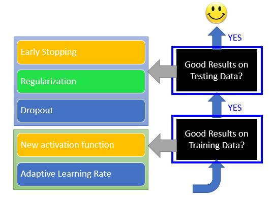

## Vanishing Gradient Problem

在训练手写数字识别的神网络的时候，随着网络层数的加深，当大于3层后，我们并没有得到效果的显著提升，反而有下降的情况，当我们进一步把网络增大到8层以后，准确度迅速下降。这是为什么呢，为什么更深更强大的网络结构没能取得更好的效果呢。

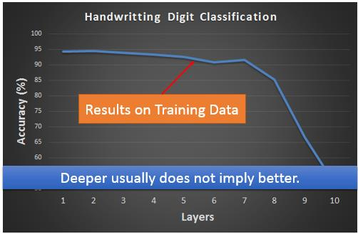

我们先从直觉上进行解释，我们上一个Note中介绍到我们神经网络的激活函数为Sigmoid函数，我们通过下图可以发现Sigmoid函数有个特点，在$z$很大或很小的时候，这时候$z$的一个很大的变化只会引起$\sigma(z)$很小的变化。所以在网络饱和时（每个神经元的输出值接近到1或-1时），靠近输入层的一个参数$w$的一个较大的变化$\Delta w$，经过网络层层传播后，只能引起输出值很小的一个变化。也就是说这时候$\frac{\partial L}{\partial w}$很小。

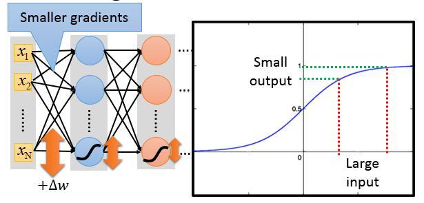

这就带来了一个问题：越靠近网络输出的地方，参数的梯度往往变化很快，学习的很快，而靠近网络输入层的参数则得到的梯度值很小，学习的很慢，所以在很长的一段时间，靠近网络输入层的地方由于参数学习的很慢还接近于随机机，产生的神经元输出也是趋于随机。 但靠近输出层的部分对这些随机值产生了收敛，最终导致整个网络都不work了。

下面是一些原理上的解决为什么会出现梯度消失：

根据反射传播我们知道，对于中间层的一个神经元，它的输入为$x$，参数为$w, b$，$z = w\cdot x + b$, 输出output为$a = \sigma(z)$

$$\frac{\partial L}{\partial w} = \frac{\partial L}{\partial z}\frac{\partial z}{\partial w} = \frac{\partial L}{\partial a}\sigma(z)(1-\sigma(z)x$$

我们可以看到后一层的梯度$\frac{\partial L}{\partial z'}$在向后传播时，剩上了系数$\sigma(z)(1-\sigma(z)x$，由于$\sigma(z) < 1$，所以$\sigma(z)(1-\sigma(z))\le \frac{1}{4}$，而$x$值因为$w$的初始化都很小，所以也接近于0。 从上面可以看出梯度在向后传播时是越来越小的。

## RELU

ReLU(rectified linear unit)是一种新的激活函数，它的提出就是为了解决Sigmoid函数存在梯度消失的问题。它的数学表达式为：

$$a = \max\{0, z\}$$

使用ReLU作为激活函数有以下4个优点：

1. Fast to compute
2. Biological reason
3. Infinite sigmoid with different biases (看以看成多个Sigmoid叠加的结果)
4. solve Vanishing gradinet problem

ReLU在实际动作时，对于每个神经元来说，如果它的输入大于0,则输出等于输入，否则为0。那整个网络就变得像下面这张图所示：

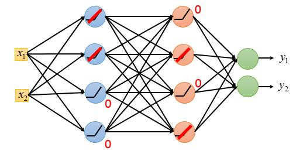

如果我们把所有响应值为0的神经元都删除掉，就变成了下面这个像子

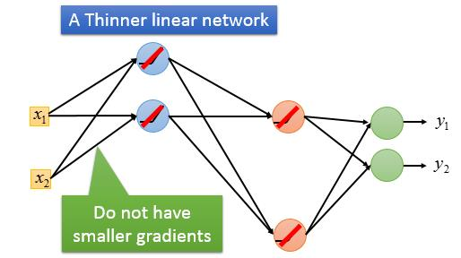

有些人会有一些疑问，如果看上面这张图，那整个神经元不就变成一个线性的结构了吗？是的，当上图的状态时，如果输入变化很小，不足以引起神经元激活值由大于0变为小于0或由小于0变为大于0,那么整个网络就是一个线性结构。但随着输入$x$的持续变化，网络结构就会随之变化。整体看来整个网络结构是一个非线性的结构。

随着深度学习技术的发展，这些年陆续又提出了多种的激活函数如PReLU和Maxout。它们的思想都是在激活函数里引入了可以学习的参数，让网络自己来决定激活函数的样子。

## Adaptive Learning Rate

关于训练神经网络另外一个重要的话题就是关于学习率的调整，从Effective Gradinet那一节中我们已经介绍了一种自适应的参数调整策略，并对不同的参数有不同的学习率。从而解决梯度大降在寻找极值点时收敛速度慢的问题。这里我们再介绍一种新的方法Moment的方法，它的灵感来自于物理运动动量的思想，它有利于我们的网络在梯度下降时越过局部极值点，进而找到最佳的极值点。

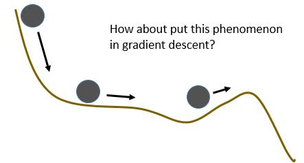

在小球经过鞍点或局部极值点时，由于惯性任然有较大向右的速度，而不会因为没有了加速度而停下来。回到我们梯度下降中来，我们在鞍点与局部极植点时由于梯度为0，所以参数就不再更新了。为了解决这个问题，我们为参数更新引入到动量。

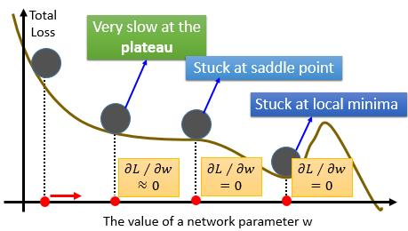

每次参数更新方法是梯度方向与上一次更新的梯度方向之合。

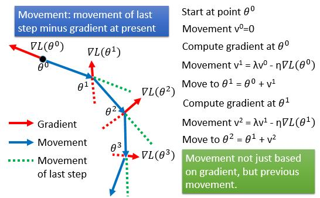

如果把上面讲的Moment方法与之前介绍的AdaGrad的方法结合在一起，就形成了Adam的方法。

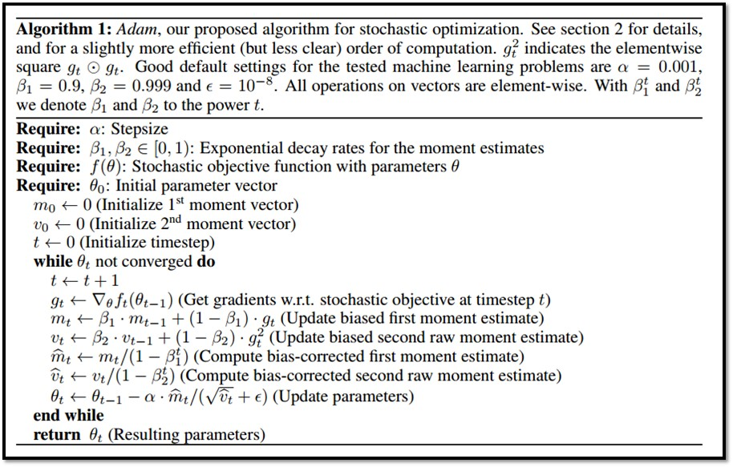

## Early Stopping

early stopping是一种防止过拟合的方法，它的基本思想就是根据训练过程中的损失曲线，选择在一个training erro与 validation set都较底的时候，停止训练，防止模型在进一步的训练中过拟合。

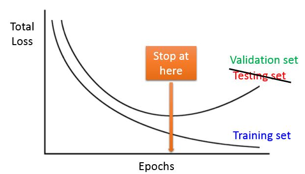

## Regularization

正则化是我们在介绍Regression中就介绍到的技术，用来防止模型过拟合，那针对于神经网络模型来说，我们同样可以选择该方法来防止模型过拟合，常见的有L1正则与L2正则化。它们分别对应的损失函数是：

$$\text{L1}: L'(\theta) = L(\theta) + \lambda\|\theta\|_1$$
$$\text{L2}: L'(\theta) = L(\theta) + \frac{1}{2}\lambda\|\theta\|_2$$

## Dropout

Dropout是一种十分有效的防止模型过拟合的方法，它的操作方法是在以一个miniBatch的数据对模型训练的时候，让每个神经元以一个概率$p$随机的不产生响应。同时，在反向传播时，也不对该神经元的参数进行更新。

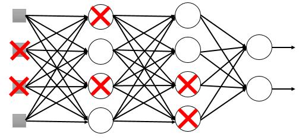

也就是说每次miniBatch的训练的神经网络的结构因为dropout的随机性，都是不同的。

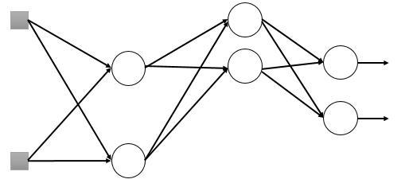

值得注意的是在Testing阶段时，为了保证输出结果的一致性，并不进行dropout。但这就存在一个问题：网络中的参数是在有dropout的情况下训练的。如果testing不进行dropout，那神经元接收到的输入就会变多，相应的输出相比训练时就会变大，那整个网络的输出就不对了。所以为了解决这个问题，一般的处理方法是在训练的时候，每个神经元的输出最终会再乘以$1/(1-p)$。这样在testing的时候就不需要做任何操作了。

以Ensemble的角度来看Dropout的作用。每个一MinihBatch都相当于以权重共享的方式训练出了一个神经网络，最终网络的输出是多们网络加权后的结果。

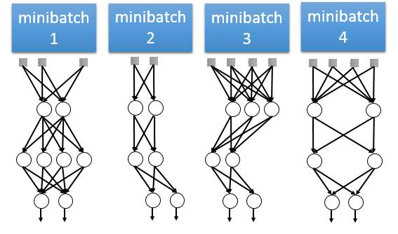

## BatchNorm

这部分是课程没有讲到的地方，但我觉得也是设计或训练一个DNN中常用的方法之一。以后有时间再来填坑。

## Conclusion

这一个Note主要介绍了在训练一个神经网络时会遇到的问题，以及解决的方法。当一个网络训练完成后，我们要先检测训练集上的准确率，如果在训练集上的准确率不高的话，我们可能需要调整模型、选择更好的参数更新方法、选择合适的激活函数来解决。进一步再看模型在训练集上的准确率，考虑使用early stopping, regularization以及dropout等防止过拟合的方法。