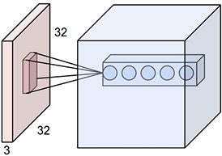
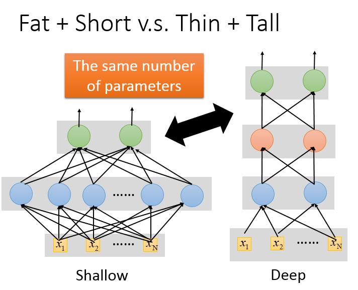

# CNN and It's application

\[[lecture1](../lectures/cnn.pdf)\]
\[[lecture2](../lectures/why_deep.pdf)\]
\[[CNN video](https://www.bilibili.com/video/av10590361/#page=11)\]
\[[Why Deep? video](https://www.bilibili.com/video/av10590361/#page=12)\]

CS231n的Lecture 12: Visualizing and Understanding \[[slides](http://cs231n.stanford.edu/slides/2017/cs231n_2017_lecture12.pdf)\]\[[video](https://www.youtube.com/watch?v=6wcs6szJWMY&list=PL3FW7Lu3i5JvHM8ljYj-zLfQRF3EO8sYv)\]

<!-- TOC -->

- [CNN and It's application](#cnn-and-its-application)
    - [CNN结构设计动机](#cnn结构设计动机)
    - [CNN的结构](#cnn的结构)
        - [卷积层的计算方式](#卷积层的计算方式)
        - [卷积层的意义](#卷积层的意义)
        - [卷积层参数计算与输入尺寸计算](#卷积层参数计算与输入尺寸计算)
        - [Pooling层的运算](#pooling层的运算)
    - [网络到底学习到了什么](#网络到底学习到了什么)
    - [Why Deep?](#why-deep)

<!-- /TOC -->
在[Note6](06_deeplearinging_intro.md)中已经介绍了深度神经网络的一般结构，以及如何利用梯度下降法来训练一个深度学习的神经网络，在[Note7](07_dnn_tips.md)中介绍了一些训练一个深度神经网络的一些经验技巧。本篇Note将介绍一个强大而应用广泛的神经网络结构——CNN(卷积神经网络)。

卷积神经网络的结构在上世纪80年代就提出来了，当时设计出来用于解决数字手写体的识别。卷积神经网络在神经元的结构上做了创新使得网络的参数大大减少，因此整个网络可以设计很深而不会发生Overfitting。那卷积神经网络设计的主要动机是什么呢？

## CNN结构设计动机

我们知道在数字手写识别的例子中，输入的图像是一个28×28的矩阵，在一般的神经网络结构中，这样的输入会变展开为一个28×28=784维的向量。这样就造成了图像像素之间空间位置信息的丢失。

另外一个考虑点是：如果我们把浅层网络都想像（事实上，通过中间层神经元的可视化证明就是如此）为在提取输入图像中的一些局部的结构化的部件（比如数字的笔划），那对于每一个局部的结构只需要输入图片一个局部区域的图像信息就够了，而不需要把整个图像的像素点作为输入。如下图所示：我们在识别下图中的小鸟时，中间的一些神经元的作用是误别鸟嘴，而这个神经元可能只关心输入图像的鸟嘴部分一个局部区域就可以了，不必要关心其他图像部分。这便是CNN中重要的**局部感受野**的概念。

另外我们注意到的事，如果我们要对图像中不同位置可能出现的鸟嘴进行检测，我们不需要额外的重新训练一个局部检测器，在另外的位置的检测器的参数和之前位置的参数相同即可。通过这个想法，我们可以让整个图像中所有局部位置对应的神经元具体相同的参数，从而检测相似的纹理或结构，这便是**参数共享**的概念。

最后我们要介绍的是CNN结构中引入的另外一个很重的layer——Pooling，它的相法也很符合直觉，当我们人眼对图像进行识别时，对于图像的大小相对来说是不敏感的，就像下图中的小鸟的图片，大一些或小一些我们都可以正确的识别，所以在CNN结构设计中，我们不妨把图像subsampling到更小的尺寸，这样就会减少中间层参数的数量。

## CNN的结构

在上面的几方面动机下，就形成了CNN的基本结构，它与普通神经网络（我们后续称之为全连接网络）相比，引入到卷积层和池化层。其中卷积层使用了局部感野和权值共享的概念，池化层就要是对图像进行降采样。两者都可以大大降低整个网络的参数量。

### 卷积层的计算方式

对于卷积而言，它的输入一般是一个多个通道的二维矩阵组成的一个三维的Tensor，如下图所示，输入是一个3通道的32×32的Tensor。

卷积层有一组卷积Filter（数量不定，可以自己设计），也就是该层的网络参数，每一个Filter都作用于输入的Tensor,输出一个Feature Map。这样的多个Filter对应的输出，就构成了一个多个FeatureMap组成的一个Tensor。

其中每一个Filter是一个$c\times w\times w$的Tensor，它与输入的Tensor之间进行卷积操作。具体的操作过程是在输入Tensor上逐行扫描，线性加权，计算响应值。下图显示了一个输入为3通道7×7的Tensor和两个3×3×3的Filter进行卷积计算的过程。

### 卷积层的意义 

实际上每一个卷积核都是在检测图像中的每一种纹理，可以把每一个Filter想像为一个模板，它在输入的图像中依次匹配过去，如果图像中的纹理或结构与Filter的结构越相似，则输出的响应值就越高，反之则越低。

### 卷积层参数计算与输入尺寸计算 

假设一个卷积层的输入尺寸为$C_1\times H_1 \times W_1$，Filter的尺寸为$C_1\times F\times F$,共有$C_2$个Filter，输入需要经过外括Pading的大小为$P$，而卷积的步长Stride为$S$，则

该卷积层的参数个数为$C_2\times C_1\times F\times F + C2$（假设有Bias）
输入的尺寸为：$C_2\times ((H1+2P-F)/S+1)\times ((H1+2P-F)/S+1)$

### Pooling层的运算

Pooling层的运算逻辑相对于卷积层来说就简单很多了，一般来说我们都是对原输入做0.5倍的降采样，这样原来输入中的一个$2\times 2$大小的区域，就对应了一个输入。
我们可以有以下几种Pooling的方法：MaxPooling，AvergePooling，NormPooling等。

## 网络到底学习到了什么

神经网络最大的弊病就是它的不可解释性，像个黑盒子一样，我们往往不知道网络中到底抓住了样本什么特性来识别样本的。

但是我们仍然可以做一些可视化的尝试，来试图理解网络中到底学习到了什么。

常见的一种可视化的方法就是对对第一个卷积层的参数进行可视化，由于第一层卷积层与输入层直接相连，它的通道数与图像的通道数相同。下面是AlexNet第一层卷积层的96个Filter的可视化的结果。

我们通过观察上面Filter，可以发现，不同的Filter负责检测原图像中不同的纹理结构或颜色。上面的一些Filter在检测图像中各种不同方向的纹理，而下面的一些Filter在检测图像中一些颜色。

上面的方法只适合分析较浅层的网络层，对于靠近输出层，较层的网络层就不适合用上面的方法进行可视化了。我们可以通过下面的方法来分析不同的输入对我们输出是怎么影响的。

在我们训练好一个神经网络后，我们把所有的参数固定下来，而随机初始化一些图像作为输入，我们观察不同的图像对中间的一些网络层的影响。尝试通过极大化某一层上某一个神经元的响应值，来观察输入是什么样的。

我们的优化目标函数是：

$$x^* = \arg\max_xa^k$$

其中$a^k$是中间某一层神经网络第$k$个Feature Map中所有元素的和，$a_k = \sum_w\sum_h a_{w,h}^k$。

我们甚至可以直接来分析输入层的神经元，看什么样的输入对其中的某个神经元的激活值最大。这个分析尤其有用，在我们做多分类的时候，输入层的第$k$个神经元的激活值越大，则说明样本越大的概率属于第$k$类。

利用这种思想，我们还可以有其他好玩的应用，比如：DeepStream和DeepStyle。

## Why Deep?

CNN给我们了一个启示：我们可以自己来设计神经网络的结构。但当我们自己去设计网络结构时，参考现在一些主流的网络结构，发现几乎所有的主流的结构都有着很深的结构，像ResNet甚至达到了150层。我们不禁会问，神经网络的结构真的越深越好吗？为什么不设计一个很宽的结构呢。

而且我们知道神经网络中有一个很著名的证明：一个隐藏层的神经网络可以逼近任何函数。那为什么我们不只用一个隐藏层的神经网络，把这一层设计很多个神经元呢。

通过做一些试验发现，在相同参数的情况下，更深的网络比更宽的网络有更好的识别效果。

实际上更深的网络往往有更好的模块的能力，浅层的网络可以提取一些基本的线条纹理等特征，高层的网络提供了更高的抽象，它们是建立在低层的网络抽象出来的基本结构基础上的。层次越来，这种逐层抽象的能力越强。
